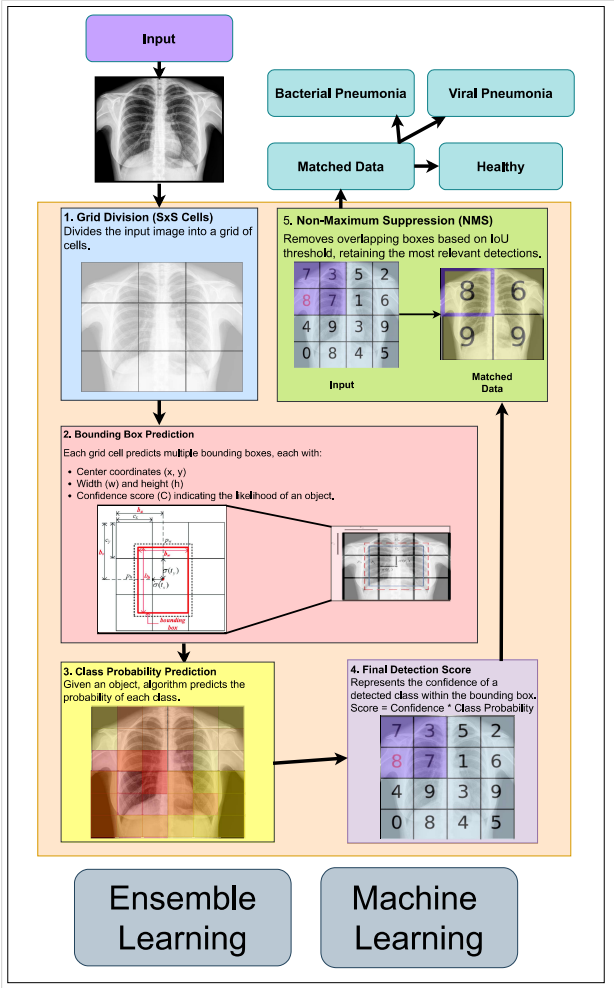

# Explainable AI for Chest X-Ray Pneumonia Detection: A Hybrid Ensemble Learning Approach

A complete, research-grade implementation for automated pneumonia diagnosis from chest X-ray (CXR) images using a hybrid ensemble of deep learning and classical machine learning, with integrated Explainable AI (XAI) for transparent, clinician-trustworthy predictions.

## Highlights

- Hybrid ensemble combining VGG-16, ResNet, EfficientNet, SVM, and Random Forest for superior accuracy and robustness.
- End-to-end pipeline: data preparation, training, ensemble aggregation, and explainability via Grad-CAM and SHAP.
- Clinically oriented transparency: heatmaps and feature attributions to validate and interpret predictions.

## System Overview

The pipeline ingests labeled CXRs (NORMAL/PNEUMONIA), applies standardized preprocessing and augmentation, runs parallel inference across five models, aggregates outputs via weighted voting, and produces XAI explanations (Grad-CAM heatmaps and SHAP plots).



## Repository Structure
```
.
├── Dataset/ # Instructions + expected Kaggle CXR structure (train/val/test)
├── Models/ # SVM, RF, VGG-16, ResNet, EfficientNet, Ensemble + saved weights
├── Explainable AI/ # Grad-CAM and SHAP scripts for trained models
└── Research Paper/ # Final Research Paper.pdf (peer-reviewed manuscript)
```

## Dataset

- Source: Chest X-Ray (Pneumonia) dataset (Kaggle).
- Labels: NORMAL, PNEUMONIA with predefined train/ val/ test splits.
- Expected structure:
```
Dataset/
├── train/
│ ├── NORMAL/
│ └── PNEUMONIA/
├── val/
│ ├── NORMAL/
│ └── PNEUMONIA/
└── test/
├── NORMAL/
└── PNEUMONIA/
```

## Preprocessing and Augmentation

- Resize to a consistent input resolution (e.g., 512×512).
- Normalize pixel intensities (e.g., divide by 255) for stable optimization.
- On-the-fly augmentation: horizontal flips, small rotations (±15°), mild Gaussian noise, brightness/contrast adjustments.

## Models

- Deep Learning: VGG-16, ResNet, EfficientNet (transfer learning and fine-tuning on CXR).
- Classical Machine Learning: SVM and Random Forest on derived image features.
- Ensemble: Weighted voting over class probabilities from all five base models.

## Performance (per reported experiments)

| Model         | Accuracy |
|---------------|----------|
| SVM           | 78%      |
| Random Forest | 78%      |
| EfficientNet  | 74%      |
| ResNet        | 90%      |
| VGG-16        | 94%      |
| Ensemble      | 96.2%    |

Notes:
- VGG-16 and ResNet showed strong, stable learning and high validation alignment.
- EfficientNet underperformed with training instability, suggesting gains via model-specific hyperparameter tuning.

## Explainability (XAI)

- Grad-CAM: Class-discriminative heatmaps highlighting regions influencing CNN decisions.
- SHAP: Quantitative attributions indicating how regions/features drive predictions toward NORMAL or PNEUMONIA.
- Combined, these tools support clinician trust and facilitate technical debugging and bias checks.

## Getting Started

### Prerequisites
- Python 3.8+
- GPU with CUDA recommended
- Install from `requirements.txt` (e.g., tensorflow, scikit-learn, numpy, matplotlib, shap)

### Installation
1) Clone
git clone https://github.com/SushenGrover/X-Ray-Pneumonia-Detection-Research-Paper.git
cd X-Ray-Pneumonia-Detection-Research-Paper

2) Create & activate env
python -m venv venv
source venv/bin/activate # Windows: venv\Scripts\activate

3) Install deps
pip install -r requirements.txt


### Dataset Setup
- Download the Kaggle Chest X-Ray (Pneumonia) dataset.
- Unzip and place it under `Dataset/` following the expected structure above.

## Training and Evaluation

Train VGG-16 (example)
python Models/train.py --model vgg16 --epochs 15 --batch_size 16

Train ResNet (example)
python Models/train.py --model resnet --epochs 15 --batch_size 16


- Trained weights are saved under `Models/`.
- Use provided notebooks/scripts to compute accuracy, precision, recall, F1, ROC-AUC, and confusion matrices.

## Generate Explanations

Grad-CAM example (ResNet)
python "Explainable AI"/generate_gradcam.py --model_path Models/resnet_model.h5 --image_path path/to/image.jpeg

SHAP example (ResNet)
python "Explainable AI"/generate_shap.py --model_path Models/resnet_model.h5 --image_path path/to/image.jpeg


## Figures

- VGG-16 Training Curves  
  

- ResNet Training Curves  
  


## Contributors

- Sushen Grover
- Ayush Shrivastava
- Aryan Abhay
- Archishman Debnath

## Acknowledgement

Special thanks to Dr. Tamilarasi K, Assistant Professor, VIT Chennai, for her invaluable guidance and continuous support throughout the course of this research.
